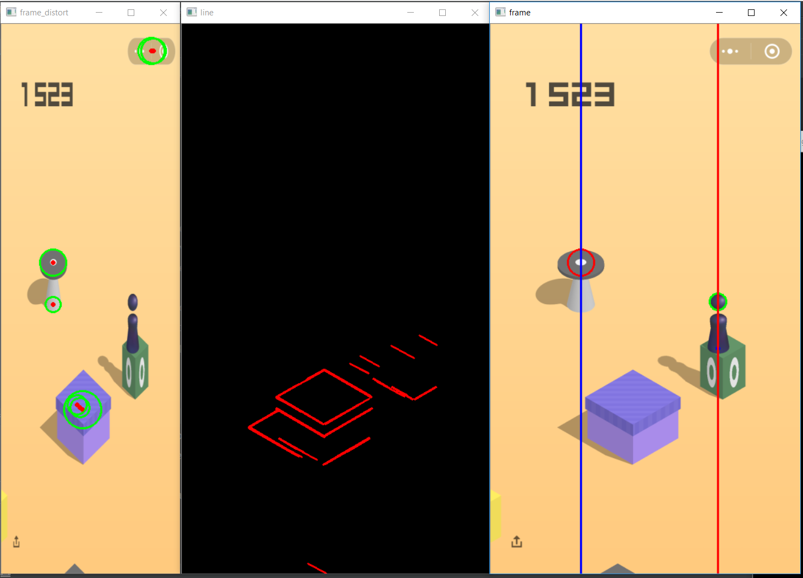

# 微信跳一跳

一个简单的微信跳一跳程序

主要使用一些简单的直线、圆检测算法


## Prerequisites
- 一部安卓手机
- adb driver
- python3
- opencv for python

## How to start
### 安装ADB 驱动
点此下载：http://dl.adbdriver.com/upload/adbdriver.zip

### 安装ADB kit
点此下载：http://adbshell.com/upload/adb.zip

解压

将main.py 复制到目录下

### 连接手机
开启USB调试模式，提供权限

### 运行
```bash
python main.py
```